# JVM:

### 图: 

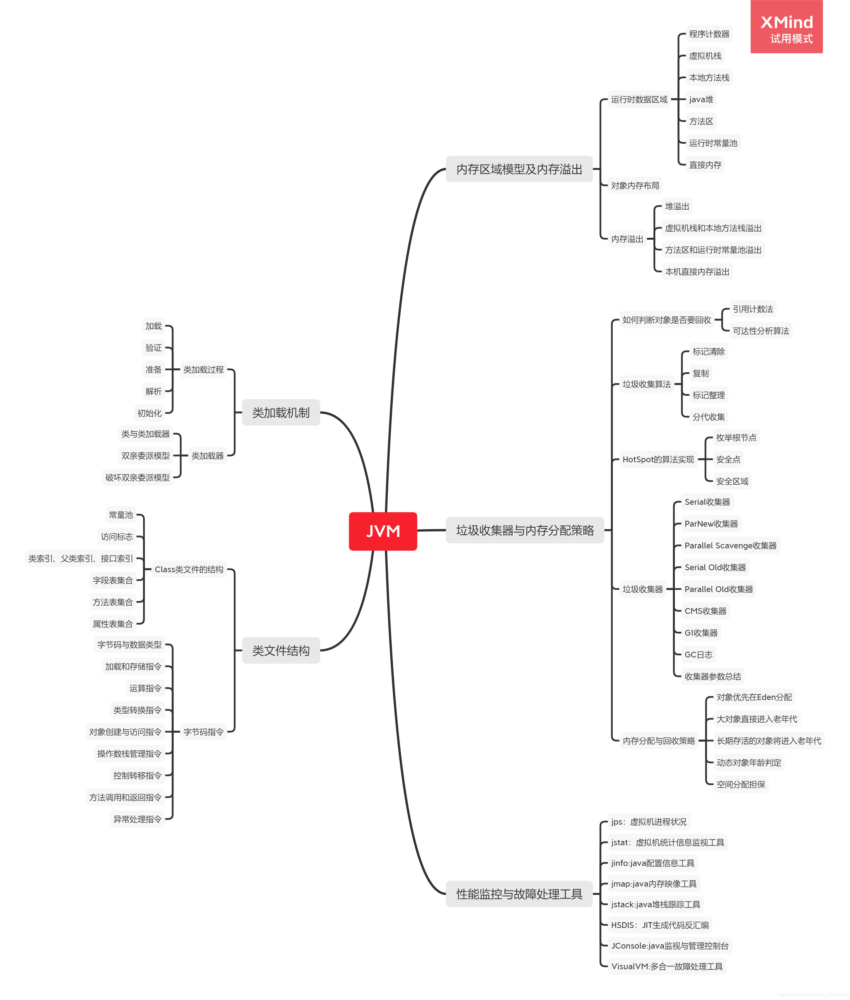

## 总结：

Java虚拟机，是模拟虚拟出一个类似计算机的环境，仿真的模拟计算机的各种功能的，包括调用CPU计算，处理内存和磁盘，还有网络，Java最大的特点，平台无关性，就是依靠于Java代码是运行在这个虚拟出来的计算机上的，与外界无关，就像我们的操作系统运行在哪个牌子的机器上都一样。

Java虚拟机内部的主要分为三个结构：

1.是类加载器系统：我们写的Java代码，需要被编译成为相应的字节码，才可以被系统识别，类被编译后生成对应的字节码文件，通过不同的加载器的架构，将我们按照Java语法定义好的结构，有序的加载、解析、初始化，最后成为可以用来执行逻辑的状态，我们的代码执行是依靠不同的字节码指令来运行的。

2.运行时数据区域：包括方法区、Java堆、虚拟机栈、本地方法栈、程序计数器(PC寄存器)，根据代码的逻辑由JVM自己维护内存的使用和垃圾的回收。课程里主要讲了串行/并行、CMS、G1三种GC，他们没有绝对的优劣，各有各的好处：（1）如果考虑吞吐优先，CPU尽量都用于处理业务，用 Parallel GC。（2）如果考虑有限的低延迟，且每次GC时间尽量短，用 CMS GC。（3）如果堆较大，同时希望整体来看平均GC时间可控，使用 G1 GC。

3.执行引擎：我们得到的字节码并不是直接拿来就能运行在操作系统上，因为字节码不等价于机器指令，JVM的主要任务是负责装载字节码到期内部，然后将字节码解释为对应平台上的本地机器指令然后执行。

JVM的调优和故障检查，我们开发过程中遇到的最重要的能力，官方也为我们提供了很多自带的工具来辅助我们观察。

# NIO

### 图：

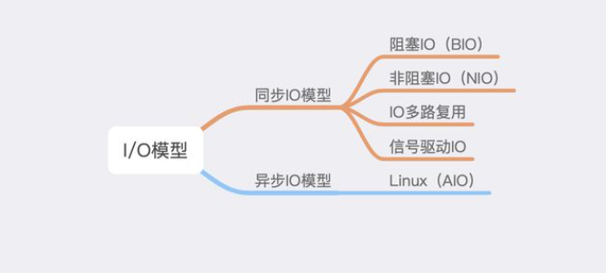

## 总结:

不同I/O其实就是操作系统内核空间和用户空间的转换算法不同，IO的速度和CPU的速度、内存的速度，有着数量级级别的差距，尽量的减少CPU在IO方面的消耗，让把IO托管出去，是发展的目的。

现有的网络IO模型主要分五类：

1. 阻塞且同步的BIO，业务线程完全停止，等待IO完成。
2. 阻塞且同步的多路复用多路复用的IO模型（也称为事件驱动IO、Reactor模式）（NIO+Select或Epoll）提出一个Reactor，这么一个角色，去专门处理轮询的这块逻辑。
3. 非阻塞的NIO，业务线程轮询，轮询和轮询中间的这段时间就是可以节省下来干别的的资源。
4. 非阻塞的信号驱动IO，不需要轮询，直接告诉内核你要什么，内核有了就给你发个信号，用户线程收到新号立马去调用Recvfrom去接收数据。
5. 异步非阻塞的AIO（Proactor模式），直接告诉内核，我要一个什么样子的数据，然后啥都不管了，内核直接把剩下的步骤全都干完，再给你用户线程发信号，直接就有数据可用了，linux不支持，windows的IOCP支持。

我们现在最主要用到的是NIO模型，其实Netty框架由于其强大的性能和易用的特点，成为现在事实上的行业标准，涉及到IO的，大部分都在用Netty。

Netty：

对Java NIO进行了优化，Java的NIO ，由于其基础性、通用性的定位，往往过于关注技术模型上的抽象，而不是从一线应用开发者的角度去思考，非常繁琐，开发者在使用的时候，往往很痛苦。Netty 的设计强调了“关注点分离”，通过精巧设计的事件机制，将业务逻辑和无关技术逻辑进行隔离，并通过各种方便的抽象，一定程度上填补了了基础平台和业务开发之间的鸿沟，更有利于在应用开发中普及业界的最佳实践。

使用时共有三种模式：

1. Reactor单线程模式
2. 非主从的Reactor多线程模式
3. 主从的Reactor多线程模式

# 并发编程

### 图：

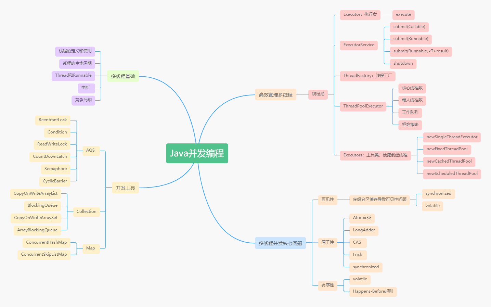

## 总结：

Java并发编程，也是Java开发的时候，最常用但也最难用好的部分，多线程的本质就是多核CPU，单核的CPU的效率追不上我们日益增长的算力需求，所以出现了多个CPU协调完成工作。但是CPU的速度过快，比内存都要快出几个数量级，所以每个CPU都用了三级缓存的方式，层级越大速度越慢但是容量相对会大一些，可是由于每个CPU都有自己的缓存，在多个CPU多个线程同时处理一个问题的时候，在内存中读到数据放到各自的缓存中处理，由于不共享，就会有可能出现脏数据，这个时候就需要有一套并发编程的方法，来解决各个线程之间数据的问题。

多线程并发的核心问题：可见性、原子性、有序性。我们所有的并发编程工具都是为了解决这3个问题。

经常用的有：synchronize，volatile（解决可见性），ReentrantLock，以及各种并发安全的集合和Map容器。

我们不可能用多线程的时候，每次都自己new一堆线程，然后再去star或者销毁，线程的创建操作是比较消耗资源的，所以我们一般使用传统艺能“池”，也就是线程池，来管理多线程：

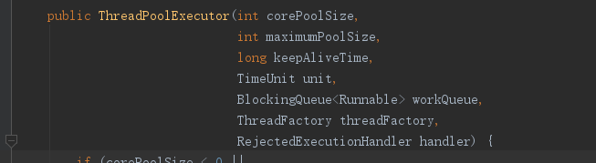

线程池执行任务的核心参数：

1. corePoolSize（核心线程池的大小）
2. maximumPoolSize（线程池中创建的最大线程数）
3. keepAliveTime（当线程数大于corePoolSize时，终止前多余的空闲线程等待新任务的最长时间）
4. keepAliveTime的时间单位
5. workQueue（存储还没来得及执行的任务）
6. threadFactory（执行程序创建新线程时使用的工厂）
7. RejectedExecutionHandler （拒绝策略处理器）

线程池的execute方法：

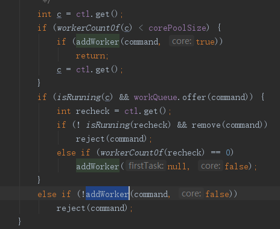

​	一个任务进来之后，先判断工作线程数，是不是小于核心线程数，如果适用核心线程数，增加线程去执行任务。如果达到了核心线程数，这些线程都在工作呢，再进来的任务就都放到workQueue队列里，重新检查线程池的运行状态，如果不处于运行状态了就移除任务，如果移除成功，就执行拒绝任务处理，如果线程池还没关闭，但是工作线程的数量是0则创建一个空闲的工作线程。如果workQueue满了，判断是不是到了最大线程数量，不是就继续创建，尝试添加任务，否则，执行拒绝策略。

# Spring 和 ORM 等框架

### ORM：

主要是分为Hibernate和Mybatis，其各自的优点是：

- Hibernate：是全自动，完全可以通过对象关系模型实现对数据库的操作，拥有完整的JavaBean对象与数据库的映射结构来自动生成sql，对简单的一些操作，不用写sql，框架就给你弄好了。

- Mybatis：使用原生的Sql（Xml语法），很直观的能看到到底做了什么，遇到复杂的Sql查询需求下，可以很方便的执行，对DBA很友好，而且很轻便。

缺点：

Hibernate：对一些Sql，Hibernate会做一些转变，最后真正执行出去的那个sql，人工看起来就很困难了，如果有DBA人员进行Sql审计，去检查你的Sql的性能，他们看起来会很难受，就算让你去调优，你也不知道写的Hql到底要怎么改，才能改成目标的样子。

MyBatis：繁琐，可能要用一些插件

### Spring：

### 图：

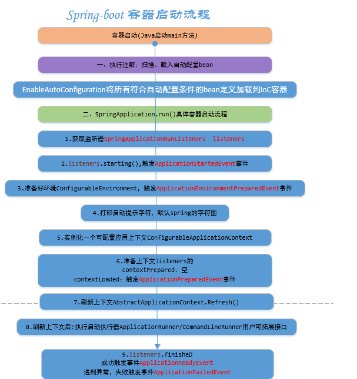

Spring Boot是由Pivotal团队提供的全新框架，其设计目的是用来简化新Spring应用的初始搭建以及开发过程。该框架使用了特定的方式来进行配置，从而使开发人员不再需要定义样板化的配置。通过这种方式，广泛应用于快速应用开发领域。

SpringBoot的优点：

1. 使用 Spring 项目引导页面可以在几秒构建一个项目
2. 方便对外输出各种形式的服务，如 REST API、WebSocket、Web、Streaming、Tasks
3. 非常简洁的安全策略集成
4. 支持运行期内嵌容器，如 Tomcat、Jetty
5. 强大的开发包，支持热启动
6. 自动管理依赖
7. 自带应用监控

SpirngBoot的缺点：

1. 集成度较高，使用过程中不太容易了解底层。

# MySQL 数据库和 SQL

### 图：

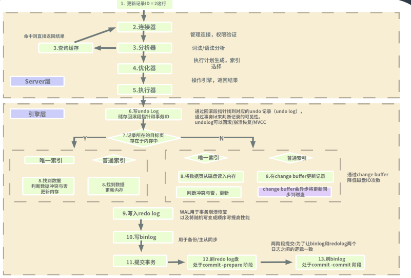

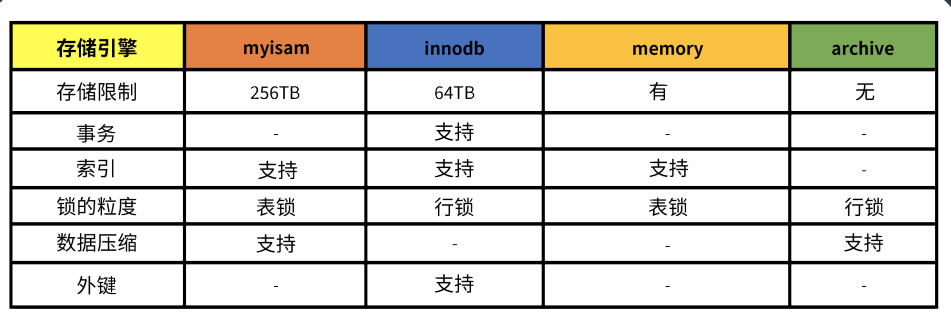

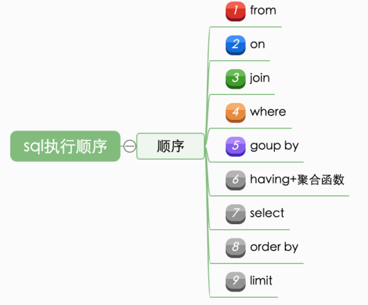

前三步，可以确定到表，形成一个类似虚拟的大表，处理数据的起点。中间三步，主要是过滤，留下符合条件的数据。后三步，前面的过滤完的数据，以什么样的形式，什么样的规则，去显示出来。（但是真的去执行的时候，不一定绝对按照这个顺序来，查询优化器，会按照自己的判断去处理一下）

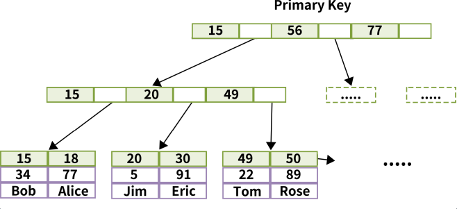

Mysql的索引一般使用B+树的结构，原理：

默认情况下，数据是和主键索引在一起的（数据存储，是按照主键索引的结构存储），这种情况下，数据都按照块存储，一块（页）数据上有多条，相邻的连续的数据，然后我们假设，比如有一条主键Id =  30的数据，被使用了，那我们猜测，后面的数据，也很快会被使用，所以使用的时候按一个块儿来操作，这个块，就相当于了缓存，能够1次性去读取磁盘，拿取数据，放到内存里，再来取，就不用去读盘了。而且如果不断的一直在拿下一块的时候，可以不用来回的去寻址，数据块与块之间有双向的指针连接，直接走指针就行了数据块也叫页。

Mysql单表的数据最好不要超过2000万？一般认为，Mysql数据库，三层以下索引，他的性能是最优的，再加一层，去通过B+树去找的时候，可能就需要多做一次磁盘操作，对性能影响很大。

事务：

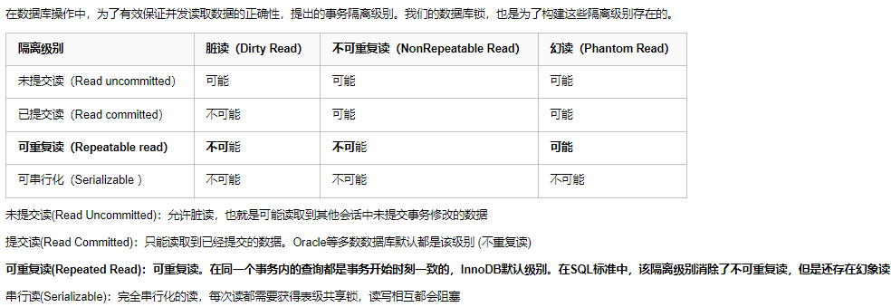

事务的隔离级别分以上几种。

# 分库分表

我们处理优化我们的表结构，使数据均匀的分散在不同的子表或者子库中，分摊读写的压力，上面我们也说了，单个表最好数据不要超过2000万，而且当然是越小越好，所以当我们数据量太大了，无法维护，dump一下都要好几天，或者文件根本没法还原，就可以用分库分表的方式来处理。

如何选择分库还是分表？

一般情况下，如果数据本身的读写压力较大，磁盘 IO 已经成为瓶颈，那么分库比分表要好。分库将数据分散到不同的数据库实例，使用不同的磁盘，从而可以并行提升整个集群的并行数据处理能力。相反的情况下，可以尽量多考虑分表，降低单表的数据量，从而减少单表操作的时间，同时也能在单个数据库上使用
并行操作多个表来增加处理能力。

分库分表主要分为垂直拆分，水平拆分2种：

垂直拆分的优点：

1. 单库（单表）变小，便于管理和维护
2. 对性能和容量有提升作用
3. 改造后，系统和数据复杂度降低
4. 可以作为微服务改造的基础

垂直拆分的缺点：

1. 库变多，管理变复杂
2. 对业务系统有较强的侵入性
3. 改造过程复杂，容易出故障
4. 拆分到一定程度就无法继续拆分

水平拆分的优点：

1. 解决容量问题
2. 比垂直拆分对系统影响小
3. 部分提升性能和稳定性

水平拆分的缺点：

1. 集群规模大，管理复杂
2. 复杂 SQL 支持问题（业务侵入性、性能）
3. 数据迁移问题
4. 一致性问题
